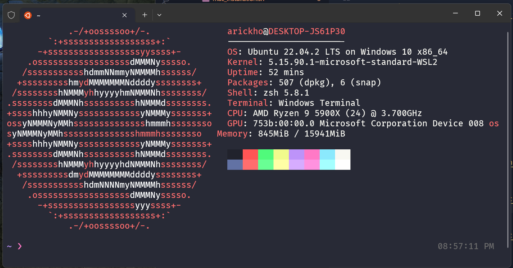

# Jordan's dotfiles



# What will be installed?

- iterm2 w/ dracula theme (mac only)
- oh-my-zsh
- zsh plugins:
   - zsh-syntax-highlighting 
   - zsh-autosuggestions
- dotfiles
- powerlevel10k
- Fira Code + MesloLGS NF fonts

## Prerequisites - Debian
```
# Update your software repositories.
sudo apt-get update
sudo apt-get upgrade

# Install Git.
sudo apt-get install -y git

# Install Fira Code and MesloLGS NF fonts
```

## Installation

```
./bootstrap.sh
```
