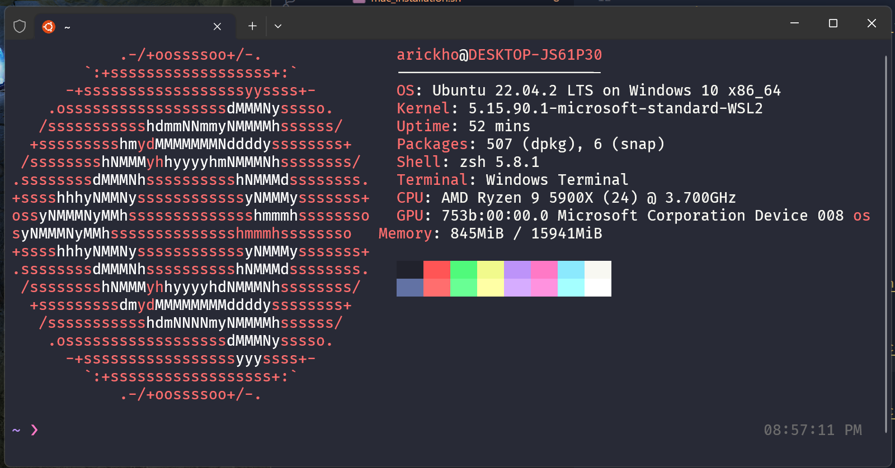

# Jordan's dotfiles



# What will be installed?

- iterm2 w/ dracula theme (mac only)
- oh-my-zsh
- zsh plugins:
  - zsh-syntax-highlighting
  - zsh-autosuggestions
- dotfiles
- powerlevel10k
- gh
- nvm
- fzf
- neovim
- lazyvim

## Installation

```
./bootstrap.sh
```
