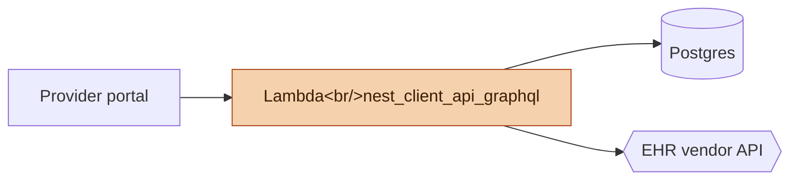
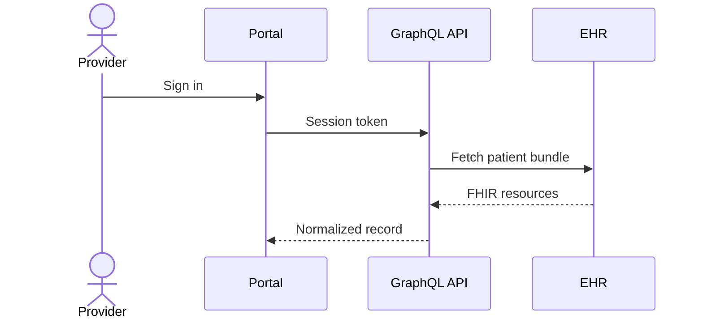
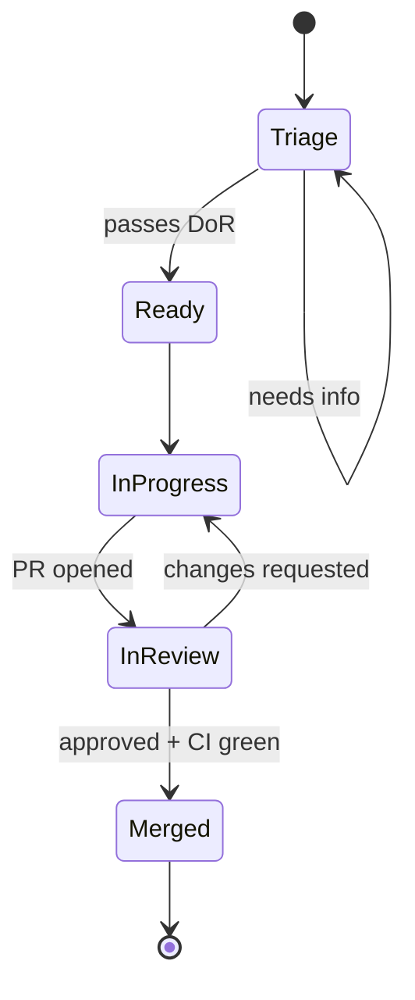
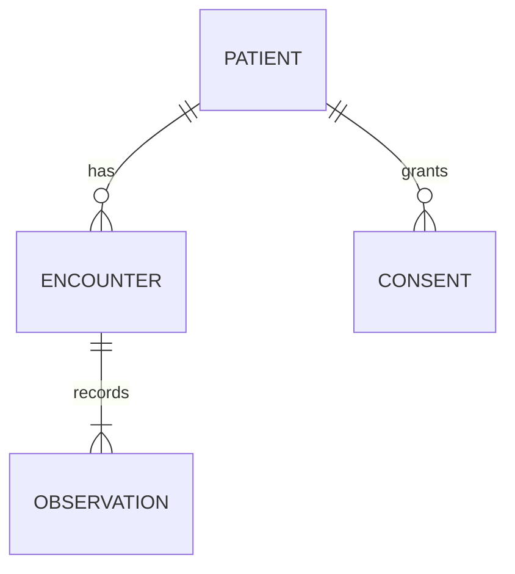
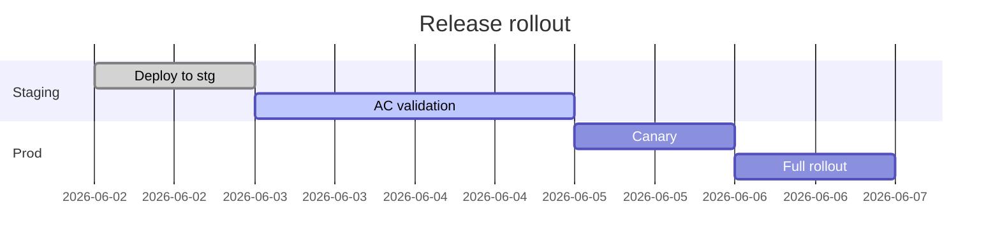
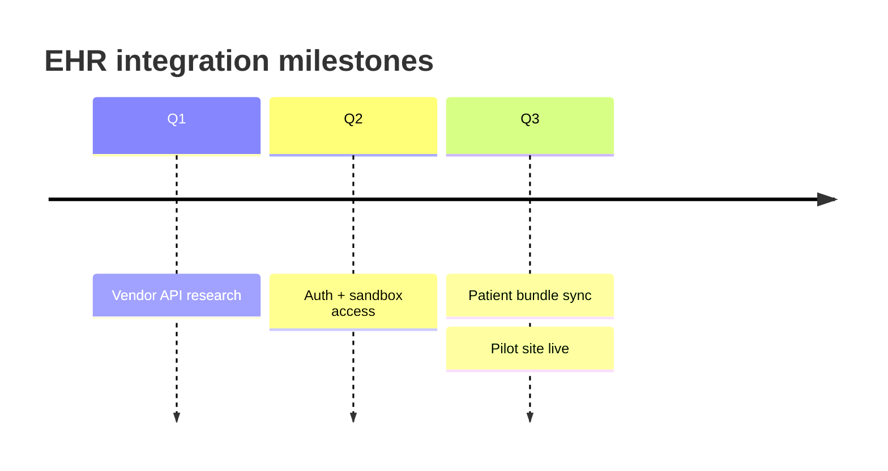
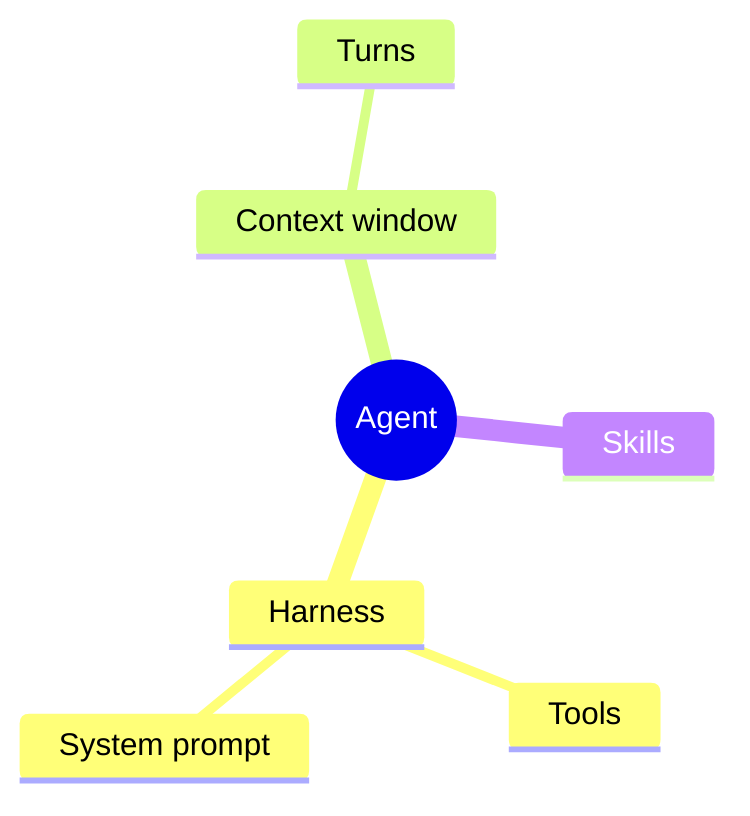
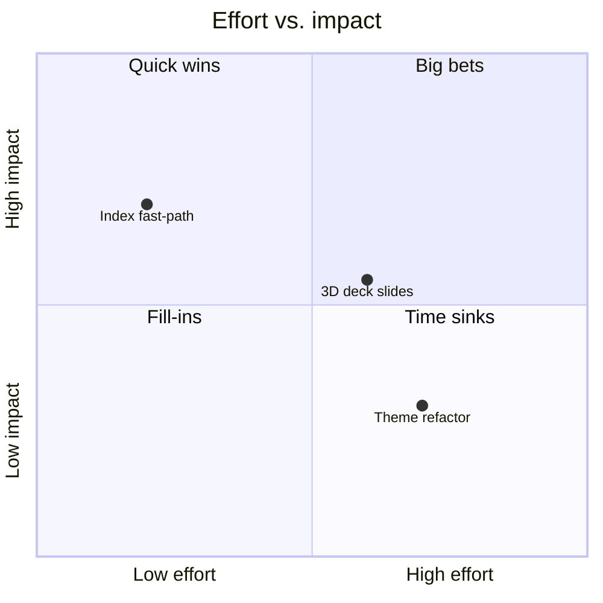
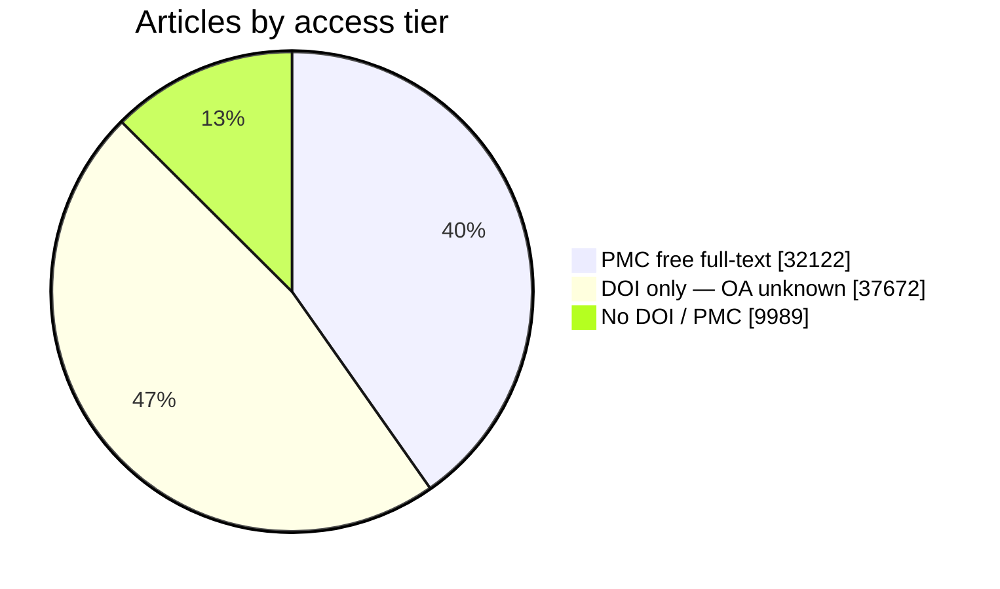

# Mermaid and Inline SVG

Use when the content needs diagrams, request flows, architecture sketches, timelines, or simple static charts.

## Mermaid diagrams (when prose isn't enough)

For some content — system topologies, request flows, before/after architectures, phased dependencies — a diagram lands the point faster than three paragraphs. Use mermaid when:

- You're describing **two or more components and how they connect** (request paths, network topologies, data flows).
- You're contrasting **before vs. after** or **today vs. target** architecturally.
- You're showing a **sequence of phases** with dependencies between them.

Don't use mermaid when prose already does the job. A 3-step list isn't a flowchart.

### Reference docs (when you need more than the patterns below)

The examples in this skill cover the common Nest cases, but mermaid supports far more syntax and per-diagram config. When you need a diagram type or option not shown here, reach for the official docs rather than guessing:

| Resource | Use it for |
|---|---|
| **Diagram syntax index** — https://mermaid.js.org/intro/ | The canonical list of every diagram type and its full grammar. Each type (flowchart, sequence, state, ER, etc.) has its own page with every keyword. |
| **Live editor** — https://mermaid.live/ | Paste a diagram, see it render instantly, copy the working source back. The fastest way to debug a parse error before pasting into the HTML — it shows the exact line that fails. |
| **Config / theming** — https://mermaid.js.org/config/theming.html | `themeVariables`, custom `classDef` palettes, per-diagram directives (`%%{init: {...}}%%`). Use when the defaults don't match the brand. |
| **Flowchart page** — https://mermaid.js.org/syntax/flowchart.html | Node shapes, edge types, subgraphs, link styling — the diagram type you'll use most. |

Pin to mermaid v10 (the CDN script below) so syntax stays stable; the docs default to the latest, so cross-check the version selector if a feature seems missing in render.

### Diagram types to reach for (gallery of options)

Pick the diagram type that matches the *shape* of what you're explaining. Each block below is ready to drop inside a `<div class="mermaid">…</div>` (in the long-form doc) or onto a deck slide. Match the kind to the content — don't default to a flowchart for everything.

**Flowchart** — request paths, decision logic, before/after architecture. The workhorse.



**Sequence diagram** — ordering and timing across services: auth handshakes, API call chains, who calls whom in what order.



**State diagram** — lifecycles and status machines: a ticket moving through DoR → review → merge, a job's states, an order's status transitions.



**ER diagram** — database tables and how they relate. Pairs perfectly with the "tables we're touching" pattern in an implementation plan.



**Gantt** — phased rollouts and timelines *with dependencies* (one task starts `after` another). Use for release/migration sequencing.



**Timeline** — chronological milestones where you *don't* need dependency arrows, just "what happened when".



**Mindmap** — breaking a concept into its parts; good for the brainstorm/decomposition slide (and a flat-2D cousin of the three.js constellation above).



**Quadrant chart** — prioritization on two axes (impact vs. effort, reach vs. risk). One slide that frames a whole roadmap conversation.



**Pie chart** — parts of a whole as proportions (access tiers, outcome splits, budget shares). The one case where mermaid does a *quantity* well; for anything you need to compare precisely, prefer a D3 donut (`examples/d3-chart-catalog.html`). Set the brand slice colors via `themeVariables` (`pie1`–`pie4`) in `mermaid.initialize`.



Quick map from content to diagram type:

| What you're showing | Diagram |
|---|---|
| How components connect / a decision branches | **Flowchart** |
| Order of calls across services over time | **Sequence** |
| An entity moving through statuses | **State** |
| Tables and their relationships | **ER** |
| Phases with start/finish dependencies | **Gantt** |
| Milestones in time, no dependencies | **Timeline** |
| A concept broken into sub-parts | **Mindmap** |
| Items ranked on two axes | **Quadrant** |
| Proportions / parts of a whole | **Pie** (or D3 donut) |

A rendered reference of all nine mermaid types **plus** the three hand-rolled SVG chart patterns (vertical bar, CSS horizontal bars, donut) ships with the skill: **`examples/mermaid-and-charts-gallery.html`** — open it to see each one on the brand, copy the source.

### Wiring it in

Add the CDN script in `<head>` (just under the Google Fonts link) and a small `<style>` rule for the diagram container:

```html
<script src="https://cdn.jsdelivr.net/npm/mermaid@10/dist/mermaid.min.js"></script>
```

```css
/* A clean white floating card — NOT a tinted box. Mermaid diagrams should feel
   like technical figures, not orange callout cards. Neutral hairline + soft
   shadow gives depth; color belongs inside the graph only when it encodes state. */
.mermaid {
  background: color-mix(in oklch, var(--ink) 3%, var(--bg));   /* theme-aware card: white-ish in light, raised-dark in dark */
  border: 1px solid color-mix(in oklch, var(--ink) 10%, transparent);
  border-radius: 14px;
  box-shadow: 0 1px 2px rgba(10,10,10,.05), 0 10px 30px rgba(10,10,10,.07);
  padding: 26px;
  margin: 30px auto;
  text-align: center;
  overflow-x: auto;
}
html[data-mode="dark"] .mermaid { box-shadow: none; }   /* shadows don't read on dark — the raised bg + border carry it */
.mermaid svg { max-width: 100%; height: auto; }
/* entrance animation keyframe (continuous-flow opt-in only; the draw-on entrance is pure JS) */
@keyframes mermaid-dashflow { to { stroke-dashoffset: -12; } }
.diagram-caption {
  text-align: center;
  font-size: 13px;
  color: var(--ink-soft);
  margin: -16px 0 32px;
  font-style: italic;
}
```

Initialize at the top of the closing `<script>` block (so it picks up the saved theme/mode for dark-mode rendering). We use `startOnLoad: false` and call `run()` ourselves so we can **animate the diagram in after it renders** — edges draw themselves on, nodes fade in, staggered. It respects `prefers-reduced-motion` (no-op) and never touches node `transform` (mermaid uses that for positioning — overriding it collapses every node to the origin):

Important: Mermaid's JS `themeVariables` parser expects concrete CSS color values. Do **not** pass `var(--ink)` or `color-mix(...)` strings there; style the surrounding `.mermaid` container with CSS variables, but give Mermaid static neutral hex values and reserve semantic highlight colors inside explicit `classDef` rules.

```javascript
if (window.mermaid) {
  var isDark = (document.documentElement.getAttribute('data-mode') === 'dark') ||
               (document.documentElement.getAttribute('data-mode') === 'system' &&
                window.matchMedia && window.matchMedia('(prefers-color-scheme: dark)').matches);
  window.mermaid.initialize({
    startOnLoad: false,                 // we run() ourselves so we can animate after render
    theme: isDark ? 'dark' : 'default',
    themeVariables: {
      fontFamily: '-apple-system, BlinkMacSystemFont, "Segoe UI", Helvetica, Arial, sans-serif',
      primaryColor: isDark ? '#171717' : '#f7f7f5',
      primaryTextColor: isDark ? '#f3ece4' : '#151515',
      primaryBorderColor: isDark ? '#5a5650' : '#c9c7c2',
      lineColor: isDark ? '#a9a39b' : '#6f6b65',
      secondaryColor: isDark ? '#202020' : '#f1f1ee',
      tertiaryColor: isDark ? '#121212' : '#fbfbfa'
    },
    flowchart: { curve: 'basis', padding: 16 }
  });

  // --- entrance animation: edges draw on + nodes fade in (reduced-motion → no-op) ---
  var MERMAID_FLOW = true;    // continuous flowing-dash loop on edges (after the draw-on entrance).
                              // Set false for a one-time draw-on entrance only, with static edges after.
  var mermaidReduced = window.matchMedia && window.matchMedia('(prefers-reduced-motion: reduce)').matches;
  function animateMermaid(svg) {
    if (mermaidReduced) return;
    if (svg.__flow) { clearTimeout(svg.__flow); svg.__flow = null; }
    if (svg.__settle) { clearTimeout(svg.__settle); svg.__settle = null; }
    // edges = stroke-only paths (+ sequence message lines); they carry no positioning transform
    var edges = [].slice.call(svg.querySelectorAll('path, line.messageLine0, line.messageLine1'))
      .filter(function (p) { try { return getComputedStyle(p).fill === 'none' && p.getTotalLength && p.getTotalLength() > 4; } catch (e) { return false; } });
    edges.forEach(function (p, i) {
      var L = p.getTotalLength();
      p.style.transition = 'none'; p.style.strokeDasharray = L + ' ' + L; p.style.strokeDashoffset = L;
      p.getBoundingClientRect();    // reflow so the transition starts from the hidden state
      p.style.transition = 'stroke-dashoffset 650ms cubic-bezier(.4,.6,.2,1) ' + (i * 55) + 'ms';
      p.style.strokeDashoffset = '0';
    });
    // nodes: OPACITY ONLY — never set transform (mermaid positions nodes via their own transform)
    var mnodes = [].slice.call(svg.querySelectorAll('.node, .actor'));
    mnodes.forEach(function (n, i) {
      n.style.transition = 'none'; n.style.opacity = '0';
      n.getBoundingClientRect();
      n.style.transition = 'opacity 460ms ease ' + (120 + i * 45) + 'ms';
      n.style.opacity = '1';
    });
    // backstop: guarantee the final visible state even if the transition is throttled (e.g. the
    // doc loads in a background tab) — clear the inline styles so nothing is ever stranded invisible.
    svg.__settle = setTimeout(function () {
      mnodes.forEach(function (n) { n.style.transition = ''; n.style.opacity = ''; });
      if (!MERMAID_FLOW) edges.forEach(function (p) { p.style.transition = ''; p.style.strokeDasharray = ''; p.style.strokeDashoffset = ''; });
    }, Math.max(650 + edges.length * 55, 120 + mnodes.length * 45 + 460) + 350);
    if (MERMAID_FLOW) {
      svg.__flow = setTimeout(function () {
        edges.forEach(function (p) { p.style.transition = 'none'; p.style.strokeDasharray = '5 7'; p.style.strokeDashoffset = '0'; p.style.animation = 'mermaid-dashflow .7s linear infinite'; });
      }, 650 + edges.length * 55 + 220);
    }
  }
  var run = window.mermaid.run({ nodes: document.querySelectorAll('.mermaid:not([data-processed])') });
  var animateAll = function () { document.querySelectorAll('.mermaid svg').forEach(animateMermaid); };
  if (run && run.then) run.then(animateAll); else setTimeout(animateAll, 60);   // run() is async in v10
}
```

Each diagram lives in `<div class="mermaid" role="img" aria-label="…">...</div>` followed by a `<p class="diagram-caption">` that explains what the reader is looking at.

**Color discipline:** Mermaid defaults must be neutral/slate, not orange. Do not let every edge, container, or node inherit `--accent`. Use orange only for one deliberate emphasis node/edge when the whole point is “look here.” Use semantic colors sparingly: green for success/correct, rose/red for risk/wrong, muted ink/slate for ordinary flow. If most of the diagram is tinted, it has failed.

**Accessibility: always set `role="img"` + a one-line `aria-label` on the `.mermaid` div.** Mermaid's generated SVG ships with no accessible name, so without this a screen reader announces nothing for an entire diagram (unlike the hand-rolled SVG charts, which already carry `role="img"`+`aria-label`). The attributes survive mermaid's render — it replaces the div's innerHTML but keeps the element's own attributes — so the diagram is announced as a single labeled image, with the visible `diagram-caption` read as ordinary text after it. Make the label a plain-language summary of what the diagram shows (e.g. `aria-label="Flowchart: ClinVar matching algorithm from HGVS parse to MATCHED, AMBIGUOUS, or NOT_FOUND"`), not just "diagram".

**Decks only — render mermaid on slide activation, not at load.** In the long-form doc nothing is hidden, so `startOnLoad: true` is fine. But deck slides are `display: none` until active, and mermaid lays out by measuring text with `getBBox()` — which returns `0×0` inside a hidden element, so its layout aborts and renders the catch-all **"Syntax error in text"** box even when the diagram syntax is perfectly valid (`mermaid.parse()` will return OK on the same string). On a deck, initialize with `startOnLoad: false` and render each block the first time its slide becomes visible:

```javascript
window.mermaid && window.mermaid.initialize({ startOnLoad: false, /* theme, themeVariables… */ });
function renderMermaidIn(slide) {
  if (!window.mermaid) return;
  var animate = function () { slide.querySelectorAll('.mermaid svg').forEach(animateMermaid); };   // reuse the engine above
  var nodes = [].slice.call(slide.querySelectorAll('.mermaid:not([data-processed])'));
  if (!nodes.length) { animate(); return; }                 // already rendered → just replay the entrance
  var r = window.mermaid.run({ nodes: nodes });
  if (r && r.then) r.then(animate); else setTimeout(animate, 60);
}
// call renderMermaidIn(activeSlide) on every slide change AND for the slide active at load
```

The `:not([data-processed])` guard makes it idempotent — mermaid stamps `data-processed` on a block once rendered, so revisiting a slide never re-renders it (but the entrance animation **replays** each time the slide is shown, which is what you want in a deck). (If a "valid diagram shows a syntax-error box" on a deck, this is almost always the cause — not the diagram source.)

Do **not** use a broad `MutationObserver` on `document.body` / subtree `class` attributes to trigger Mermaid rendering. Mermaid itself mutates classes while it renders, and continuous-flow decorators may also adjust SVG nodes; observing those mutations can recursively re-enter `mermaid.run()` and make a slide hang or crash when deep-linked. Wire Mermaid rendering to the deck's explicit slide-change function instead, and keep a small in-flight guard if rendering is async.

For deck graph motion, keep the animation cheap: add one class after Mermaid renders and let CSS apply a slow dashed `stroke-dashoffset` animation to edge paths. Do **not** inject SVG circles, `mpath`, or `animateMotion` pulse dots for Mermaid deck slides. Those look nice in isolation but can peg Chrome's SVG animation path on presentation pages. Also avoid SVG `filter: drop-shadow(...)` on the Mermaid SVG; use layout, whitespace, and copy instead of filter effects for depth.

### Critical gotchas (these have all bitten us)

1. **Line breaks inside node labels MUST be `&lt;br/&gt;`, not `<br/>`.** The browser HTML-parses `<br/>` into a real `<br>` element *before* mermaid reads `.textContent`, collapsing the line break into nothing. Encoded as `&lt;br/&gt;`, it survives as literal text and mermaid renders it correctly.

   ```
   ✗ Lambda["Lambda<br/>nest_client_api_graphql"]   → renders as one line
   ✓ Lambda["Lambda&lt;br/&gt;nest_client_api_graphql"] → renders on two lines
   ```

2. **Don't mix edge types in one statement.** A solid-line opener (`--`) cannot end with a dotted-line arrow (`-.->` ). Mermaid bails on parse and the entire diagram fails to render — not just the bad edge.

   ```
   ✗ A -- "label" -.-> B           → parse error, diagram fails
   ✓ A -. "label" .-> B            → dotted arrow with label
   ✓ A -- "label" --> B            → solid arrow with label
   ```

3. **Don't use HTML entities like `&mdash;` or `&rarr;` inside node labels.** They're decoded by the browser before mermaid sees them, but mermaid sometimes mis-handles the resulting Unicode chars in label parsing. Use the literal Unicode (`—`, `→`) in the source instead — UTF-8 in HTML works fine.

4. **Avoid bare `<b>`, `<i>`, etc. inside labels.** Same HTML-parsing issue as `<br/>` — they get stripped from textContent. If you need bold inside a label, use mermaid's markdown string syntax with backticks: `A["**Bold** plain"]` (with `flowchart` and `htmlLabels: true`, which is the default).

5. **Watch for case-similar names between subgraphs and classDefs.** `subgraph Edge` + `classDef edge` both exist in the same parse table. Mermaid is technically case-sensitive, but defensive naming (`subgraph EdgeSg` + `classDef edgeStyle`) prevents a class of weird rendering bugs that come from the parser's lookup ambiguity.

6. **Pre-declare nodes inside their subgraphs.** Defining a node inline in an arrow (`A -. label .-> NewNode["..."]`) works, but the new node ends up *outside* any subgraph, even if the surrounding context is inside one. If a node belongs to a subgraph visually, declare it there.

7. **Avoid chained arrows when readability matters.** `A --> B --> C --> D` is valid but harder to debug than separate lines. When something breaks in a chain, mermaid's error messages don't tell you which segment failed. Write one edge per line.

### Color tokens for diagrams

Use these classDef colors so diagrams match the rest of the doc:

```
classDef danger fill:#fadfd8,stroke:#e65732,color:#7a2615;     /* peach + brand orange */
classDef edgeStyle fill:#f5d1ad,stroke:#b04b1d,color:#3a1d05;  /* tan + paper accent */
classDef ok fill:#e8f3ec,stroke:#2d6a4f,color:#0f1c15;         /* mint + forest accent */
classDef ship fill:#fadfd8,stroke:#e65732,color:#7a2615;       /* alias of danger for "now" */
classDef infra fill:#f5d1ad,stroke:#b04b1d,color:#3a1d05;      /* alias of edgeStyle for "infra work" */
classDef done fill:#e8f3ec,stroke:#2d6a4f,color:#0f1c15;       /* alias of ok for "shipped" */
```

These line up with the `--peach`, `--tan`, and forest theme tokens used elsewhere, so a diagram never looks like it was pasted from a different source.

## Inline SVG charts (when you have actual numbers)

When the summary contains **data the reader needs to compare or interpret** — survey counts, percentages, before/after metrics, distribution shapes — render a *static* summary chart as **hand-rolled inline SVG**, not a charting library. This keeps the doc a single self-contained `.html` file with zero external dependencies, and the brand gradients/colors stay perfectly consistent with the rest of the page. (When the reader genuinely needs to *interact* — hover to read exact values, explore a trend, distribution, or network — reach for **D3** instead; see "Interactive charts (D3)" below. Static is still the default.)

For a worked example, see [`agent-automation-survey.html`](https://tst.yoda.nestgenomics.com/nest-docs/agent-automation-survey.html) which uses three patterns: vertical bar chart, horizontal bar chart (pure CSS, no SVG), and donut chart with arcs.

### When to use a chart vs. mermaid vs. prose

| Content | Use |
|---|---|
| "X is bigger than Y" with specific numbers (4.0 vs. 4.3 vs. 3.0) | **Bar chart** |
| Distribution of values (how many people gave each rating) | **Bar chart** (vertical or horizontal) |
| Parts of a whole (50% / 25% / 25%) | **Donut chart** |
| System topology, request flow, sequence | **Mermaid** |
| Trade-offs, recommendations, narrative | **Prose** |

Charts are for *quantities*. Diagrams are for *relationships*. Prose is for *reasoning*.

### Standard chart container

```css
.chart {
  margin: 32px 0;
  padding: 26px;
  background: color-mix(in oklch, var(--ink) 3%, var(--bg));   /* theme-aware card, not a peach box */
  border: 1px solid color-mix(in oklch, var(--ink) 10%, transparent);
  border-radius: 14px;
  box-shadow: 0 1px 2px rgba(10,10,10,.05), 0 10px 30px rgba(10,10,10,.07);
}
html[data-mode="dark"] .chart { box-shadow: none; }
.chart-title {
  font-family: var(--serif);
  font-size: 22px;
  margin: 0 0 6px;
  color: var(--ink);
}
.chart-sub {
  font-size: 14px;
  color: var(--ink-soft);
  margin: 0 0 20px;
}
.chart svg { display: block; width: 100%; height: auto; overflow: visible; }
/* Donut MUST be a fixed square. Inheriting `width: 100%` from the rule above stretches
   it to the chart container width and the auto-height blows up to match. Explicit
   width+height in CSS pixels keeps the 1:1 aspect ratio regardless of container.
   `overflow: hidden` clips strokes that would otherwise escape via the parent's
   `overflow: visible` — donut strokes don't need to leak; bar value labels do. */
.chart svg.donut { width: 280px; height: 280px; max-width: 100%; margin: 0 auto; overflow: hidden; }

@media (prefers-reduced-motion: no-preference) {
  .bar-anim rect {
    transform-origin: bottom center;
    animation: bar-rise 700ms cubic-bezier(.2,.7,.2,1) backwards;
  }
  /* Arc animation only mutates stroke-dasharray — no CSS transform involved.
     Do NOT set `transform-origin` here: the arcs already use the SVG attribute
     `transform="rotate(-90)"`, and adding a CSS transform-origin promotes the SVG
     attribute to a CSS transform, which is then resolved against the element's
     CSS bounding box instead of the viewBox. The donut shatters. */
  .arc { animation: arc-draw 900ms cubic-bezier(.2,.7,.2,1) backwards; }
  @keyframes bar-rise { from { transform: scaleY(0); } to { transform: scaleY(1); } }
  @keyframes arc-draw { from { stroke-dasharray: 0 999; } }
}
```

Each chart sits in `<div class="chart">` with `<p class="chart-title">` + `<p class="chart-sub">` + the SVG.

### Gradient defs (declare once, reuse everywhere)

Inside the first chart's `<svg>`, declare the brand gradients in `<defs>` and reference them by URL elsewhere:

```html
<defs>
  <linearGradient id="g-orange" x1="0" y1="1" x2="0" y2="0">
    <stop offset="0%" stop-color="#e65732"/>
    <stop offset="100%" stop-color="#e78d32"/>
  </linearGradient>
  <linearGradient id="g-purple" x1="0" y1="1" x2="0" y2="0">
    <stop offset="0%" stop-color="#a367c8"/>
    <stop offset="100%" stop-color="#c08adb"/>
  </linearGradient>
  <linearGradient id="g-rose" x1="0" y1="1" x2="0" y2="0">
    <stop offset="0%" stop-color="#c45567"/>
    <stop offset="100%" stop-color="#e07a8a"/>
  </linearGradient>
</defs>
```

These three colors give you primary / secondary / tertiary categories without ever picking ad-hoc hex values.

### Pattern: vertical bar chart

For comparing 2–5 values on a small numeric scale (e.g. 1–5 rating). `viewBox="0 0 640 280"`, baseline at `y=200`, top at `y=40` so each unit = 40px on a 1–5 scale.

```html
<svg viewBox="0 0 640 280" role="img" aria-label="Description for screen readers">
  <defs>...gradients...</defs>
  <!-- y-axis grid + labels -->
  <g font-family="-apple-system, sans-serif" font-size="11" fill="rgba(10,10,10,0.45)">
    <line x1="56" y1="40"  x2="620" y2="40"  stroke="rgba(230,87,50,0.10)"/>
    <line x1="56" y1="200" x2="620" y2="200" stroke="rgba(230,87,50,0.18)"/>
    <text x="48" y="44" text-anchor="end">5</text>
    <text x="48" y="204" text-anchor="end">1</text>
  </g>
  <!-- bars: height = (value-1)*40, y = 200 - height -->
  <g class="bar-anim" style="animation-delay:120ms">
    <rect x="125" y="80" width="110" height="120" rx="6" fill="url(#g-orange)"/>
    <text x="180" y="68" font-family="Instrument Serif, serif" font-size="34" text-anchor="middle">4.0</text>
  </g>
  <!-- ...more bars... -->
  <!-- x-axis labels -->
  <g font-size="13" fill="rgba(10,10,10,0.75)">
    <text x="180" y="226" text-anchor="middle">Category A</text>
    <text x="180" y="244" text-anchor="middle" font-size="11" fill="rgba(10,10,10,0.5)">n = 3</text>
  </g>
</svg>
```

### Pattern: horizontal bar chart (pure CSS, no SVG needed)

Best for distributions where you have many short categories. Zero JS, just flexbox:

```html
<div class="hbar"><span class="lbl">5 / 5</span><span class="track"><span class="fill" style="width:10%"></span></span><span class="num">1</span></div>
<div class="hbar"><span class="lbl">4 / 5</span><span class="track"><span class="fill" style="width:70%"></span></span><span class="num">7</span></div>
```

```css
.hbar { display: flex; align-items: center; gap: 12px; margin: 8px 0; font-size: 13px; }
.hbar .lbl { width: 56px; color: var(--ink-soft); font-family: ui-monospace, "SF Mono", Menlo, monospace; }
.hbar .track { flex: 1; height: 14px; background: rgba(230,87,50,0.08); border-radius: 999px; overflow: hidden; }
.hbar .fill { display: block; height: 100%; background: linear-gradient(90deg, #e65732 0%, #e78d32 100%); border-radius: 999px; }
.hbar .num { width: 24px; text-align: right; color: var(--ink); font-weight: 600; }
```

### Pattern: donut chart — use D3

**Donuts use D3, not hand-rolled SVG.** The donut is the one chart where the slice geometry (arc maths, stacking via `stroke-dashoffset`) is fiddly enough that D3's arc generator earns its keep, and readers who want a donut almost always want to hover a slice for the exact value. Copy the **donut** function from `examples/d3-chart-catalog.html` (`d3.pie()` + `d3.arc()`), swap the data, and you're done.

- CDN in `<head>`: `https://cdn.jsdelivr.net/npm/d3@7` — assume readers are online. Keep the core proportions in prose too because it improves scanning, accessibility, and print/PDF output.
- Keep the **fixed brand slice palette** (orange `#e65732`, purple `#a367c8`, rose `#c45567`, amber `#e78d32`); set every *structural* color (centerpiece text, stroke separators) with `.style('fill','var(--ink)')` / `var(--bg)` so it flips with theme + light/dark.
- Always pair it with a legend (swatch + count) and a visually-hidden `<table class="sr-only">` of the data for screen readers.

Bar charts and horizontal bars stay hand-rolled SVG/CSS (cheap, zero-dependency); only the **donut** reaches for D3 by default.

### Sizing math (memorize this)

| Chart | viewBox | Anchor points |
|---|---|---|
| Vertical bars (1–5 scale) | `0 0 640 280` | baseline `y=200`, top `y=40`, unit = 40px |
| Vertical bars (0–100%) | `0 0 640 280` | baseline `y=200`, top `y=40`, unit = 1.6px per percent |
| Donut | `0 0 160 160` | center `(80, 80)`, `r=60`, `stroke-width=22` |

Once you commit to these dimensions, you can copy-paste a chart between docs and the proportions hold.

### Critical gotchas

1. **Declare `<defs>` only once per document.** If you have three bar charts using `g-orange`, declare gradients once in the first chart's SVG. Subsequent charts reference `url(#g-orange)` and inherit. Duplicating defs across charts works but bloats the file.
2. **`role="img"` + `aria-label` on every SVG.** Screen readers ignore SVG content by default; the label is what gets announced.
3. **`overflow: visible` on `.chart svg`.** Bar value labels (the big serif numbers above each bar) extend slightly above the SVG's viewBox top — without `overflow: visible` they get clipped.
4. **Donuts MUST use `class="donut"` and the scoped `.chart svg.donut` rule.** The default `.chart svg { width: 100% }` rule is tuned for the wide bar-chart viewBox (`0 0 640 280`, ~2.3:1). A square donut viewBox (`0 0 160 160`) with `width: 100%` stretches to the container width and `height: auto` follows, producing a 700px+ tall donut and a centerpiece text that grows in proportion. The `.donut` class pins the SVG to `280×280` CSS pixels and re-clips overflow.
5. **Never add `transform-origin` to `.arc` (or any SVG element with a `transform` attribute).** The donut arcs use the SVG attribute `transform="rotate(-90)"` to align slice start points to 12-o'clock. If a CSS rule adds `transform-origin`, the browser promotes the SVG attribute into a CSS transform and resolves it against the element's CSS bounding box, not the viewBox center — slices fly off in random directions. The arc-draw keyframe only animates `stroke-dasharray`, so no transform-origin is ever needed.
6. **Animations run on first paint, not when the chart scrolls into view.** That's intentional for the doc format — the reader scrolls top-to-bottom and the animations replay on reload, not as they encounter each chart. Don't add IntersectionObserver-driven animations; they add complexity without improving the reading experience.
7. **No interactivity, no hover states, no tooltips — by default.** A static summary chart communicates the shape of the data at a glance. *Exception:* when the reader genuinely needs to hover-to-read or explore, use an interactive **D3** chart (see the next section) — a deliberate opt-in, not the default.
