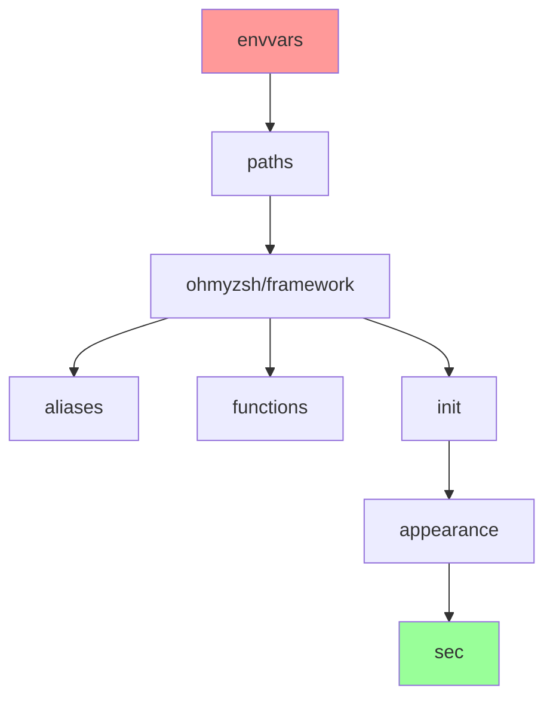

# Modular Zsh Configuration Integration Guide

## Introduction

This guide demonstrates how to integrate existing modular zsh configurations with XDG-compliant systems, using the zoxide configuration issue as a case study.

## Modular Configuration Architecture

### Benefits of Modular Approach

1. **Separation of Concerns**: Each module handles specific functionality
2. **Maintainability**: Easy to update individual components
3. **Portability**: Modules can be shared across systems
4. **Debugging**: Isolate issues to specific modules
5. **Selective Loading**: Enable/disable features as needed

### Standard Module Structure

```
~/.zshrc-modules/
├── .zshrc.starship          # Prompt configuration
├── .zshrc.ohmyzsh           # Framework setup
├── .zshrc.envvars           # Environment variables
├── .zshrc.aliases           # Command shortcuts
├── .zshrc.functions         # Custom functions
├── .zshrc.init              # Tool initialization (zoxide, fzf, etc.)
├── .zshrc.paths             # PATH modifications
├── .zshrc.appearance        # Colors, themes, visual settings
├── .zshrc.sec               # Security configurations
└── .zshrc.personal          # Personal customizations
```

## Integration Patterns

### Pattern 1: Bridge Configuration (Recommended)

Create a bridge file that loads your modules into the target system.

**Use Case**: XDG-compliant systems that auto-load `conf.d/` directories

**Implementation**:
```bash
# File: ~/.config/zsh/conf.d/01-custom-modules.zsh
#!/usr/bin/env zsh

if [[ -d "$HOME/.zshrc-modules" ]]; then
    modules_to_load=(
        "starship"
        "ohmyzsh" 
        "envvars"
        "aliases"
        "functions"
        "init"
        "paths"
        "appearance"
        "sec"
    )
    
    for module in "${modules_to_load[@]}"; do
        module_file="$HOME/.zshrc-modules/.zshrc.$module"
        [[ -f "$module_file" ]] && source "$module_file"
    done
fi
```

### Pattern 2: Conditional Sourcing

Add conditional loading to your main configuration.

**Use Case**: Systems where you control the main config file

**Implementation**:
```bash
# File: ~/.zshrc or ~/.config/zsh/.zshrc
load_modular_config() {
    local modules_dir="$HOME/.zshrc-modules"
    
    [[ ! -d "$modules_dir" ]] && return 1
    
    # Load in dependency order
    local modules=(
        "envvars"    # Must be first
        "paths"      # Early in process
        "ohmyzsh"    # Framework setup
        "starship"   # Prompt
        "aliases"
        "functions"
        "init"       # Tool initialization
        "appearance"
        "sec"        # Security settings last
    )
    
    for module in "${modules[@]}"; do
        local module_file="$modules_dir/.zshrc.$module"
        if [[ -f "$module_file" ]]; then
            source "$module_file"
        else
            echo "Warning: Module $module not found at $module_file"
        fi
    done
}

# Load modular configuration
load_modular_config
```

### Pattern 3: Symlink Integration

Create symbolic links to integrate with existing systems.

**Use Case**: When you want to maintain a single source of truth

**Implementation**:
```bash
# Create symlink to main modular config
ln -sf ~/.zshrc ~/.config/zsh/user.zsh

# Or create individual symlinks
mkdir -p ~/.config/zsh/modules
for module in ~/.zshrc-modules/.zshrc.*; do
    basename_module=$(basename "$module" .zshrc.)
    ln -sf "$module" "~/.config/zsh/modules/$basename_module.zsh"
done
```

## Module Design Best Practices

### 1. Environment Variables Module
```bash
# ~/.zshrc-modules/.zshrc.envvars
#!/usr/bin/env zsh

# Editor preferences
export EDITOR="${EDITOR:-nvim}"
export VISUAL="$EDITOR"

# XDG Base Directory Specification
export XDG_CONFIG_HOME="${XDG_CONFIG_HOME:-$HOME/.config}"
export XDG_DATA_HOME="${XDG_DATA_HOME:-$HOME/.local/share}"
export XDG_CACHE_HOME="${XDG_CACHE_HOME:-$HOME/.cache}"

# Application-specific
export DOCKER_CONFIG="$XDG_CONFIG_HOME/docker"
export CARGO_HOME="$XDG_DATA_HOME/cargo"
```

### 2. Tool Initialization Module
```bash
# ~/.zshrc-modules/.zshrc.init
#!/usr/bin/env zsh

# Load version managers
[[ -s "$HOME/.nvm/nvm.sh" ]] && source "$HOME/.nvm/nvm.sh"
[[ -d "$HOME/.pyenv" ]] && eval "$(pyenv init -)"

# Initialize navigation tools
command -v zoxide >/dev/null && eval "$(zoxide init zsh)"
command -v fzf >/dev/null && eval "$(fzf --zsh)"
command -v starship >/dev/null && eval "$(starship init zsh)"

# Load completion systems
autoload -Uz compinit && compinit

# Initialize syntax highlighting (must be last)
[[ -f "/usr/share/zsh/plugins/zsh-syntax-highlighting/zsh-syntax-highlighting.zsh" ]] && \
    source "/usr/share/zsh/plugins/zsh-syntax-highlighting/zsh-syntax-highlighting.zsh"
```

### 3. Aliases Module
```bash
# ~/.zshrc-modules/.zshrc.aliases
#!/usr/bin/env zsh

# System shortcuts
alias ll='ls -alF'
alias la='ls -A'
alias l='ls -CF'

# Safety nets
alias rm='rm -i'
alias cp='cp -i'
alias mv='mv -i'

# Modern replacements
command -v eza >/dev/null && alias ls='eza --icons'
command -v bat >/dev/null && alias cat='bat'
command -v rg >/dev/null && alias grep='rg'

# Git shortcuts
alias gs='git status'
alias ga='git add'
alias gc='git commit'
alias gp='git push'
alias gl='git log --oneline --graph --decorate --all'
```

### 4. Functions Module
```bash
# ~/.zshrc-modules/.zshrc.functions
#!/usr/bin/env zsh

# Create directory and cd into it
mkcd() {
    mkdir -p "$1" && cd "$1"
}

# Extract various archive formats
extract() {
    if [[ -f "$1" ]]; then
        case "$1" in
            *.tar.bz2)   tar xjf "$1"     ;;
            *.tar.gz)    tar xzf "$1"     ;;
            *.bz2)       bunzip2 "$1"     ;;
            *.rar)       unrar e "$1"     ;;
            *.gz)        gunzip "$1"      ;;
            *.tar)       tar xf "$1"      ;;
            *.tbz2)      tar xjf "$1"     ;;
            *.tgz)       tar xzf "$1"     ;;
            *.zip)       unzip "$1"       ;;
            *.Z)         uncompress "$1"  ;;
            *.7z)        7z x "$1"        ;;
            *)           echo "'$1' cannot be extracted via extract()" ;;
        esac
    else
        echo "'$1' is not a valid file"
    fi
}

# Find and kill processes
fkill() {
    local pid
    pid=$(ps -ef | sed 1d | fzf -m | awk '{print $2}')
    
    if [[ -n "$pid" ]]; then
        echo "$pid" | xargs kill -"${1:-9}"
    fi
}
```

## Loading Order Considerations

### Critical Dependencies



### Priority Levels

1. **Critical (Load First)**
   - `envvars`: Environment variables needed by other modules
   - `paths`: PATH modifications for tool availability

2. **Framework (Early)**
   - `ohmyzsh`: Framework setup that other modules depend on
   - `starship`: Prompt configuration

3. **User Features (Middle)**
   - `aliases`: Command shortcuts
   - `functions`: Custom functions
   - `init`: Tool initialization

4. **Cosmetic (Late)**
   - `appearance`: Visual customizations
   - `sec`: Security settings (may override other settings)

## Troubleshooting Integration Issues

### Common Problems

1. **Module Not Loading**
   ```bash
   # Debug: Check if module file exists and is readable
   check_module() {
       local module="$1"
       local module_file="$HOME/.zshrc-modules/.zshrc.$module"
       
       [[ -f "$module_file" ]] || echo "Missing: $module_file"
       [[ -r "$module_file" ]] || echo "Not readable: $module_file"
       
       # Test loading
       zsh -c "source '$module_file' 2>&1" || echo "Error loading $module"
   }
   ```

2. **Wrong Loading Order**
   ```bash
   # Debug: Trace loading order
   debug_loading_order() {
       local modules_dir="$HOME/.zshrc-modules"
       
       echo "Loading order:"
       for module_file in "$modules_dir"/.zshrc.*; do
           echo "  $(basename "$module_file")"
           source "$module_file" && echo "    ✓ Loaded" || echo "    ✗ Failed"
       done
   }
   ```

3. **Environment Variable Conflicts**
   ```bash
   # Debug: Check for conflicts
   debug_env_conflicts() {
       echo "PATH conflicts:"
       echo "$PATH" | tr ':' '\n' | sort | uniq -d
       
       echo "Duplicate aliases:"
       alias | cut -d= -f1 | sort | uniq -d
   }
   ```

### Testing Integration

```bash
# Test script for modular configuration
test_modular_config() {
    echo "Testing modular zsh configuration..."
    
    # Test each module individually
    local modules_dir="$HOME/.zshrc-modules"
    local failed_modules=()
    
    for module_file in "$modules_dir"/.zshrc.*; do
        local module_name=$(basename "$module_file" .zshrc.)
        
        if zsh -c "source '$module_file'" 2>/dev/null; then
            echo "✓ $module_name"
        else
            echo "✗ $module_name"
            failed_modules+=("$module_name")
        fi
    done
    
    if [[ ${#failed_modules[@]} -gt 0 ]]; then
        echo "Failed modules: ${failed_modules[*]}"
        return 1
    else
        echo "All modules loaded successfully!"
        return 0
    fi
}
```

## Migration Strategies

### From Monolithic to Modular

```bash
# Migration helper script
migrate_to_modular() {
    local source_file="$1"
    local modules_dir="$HOME/.zshrc-modules"
    
    mkdir -p "$modules_dir"
    
    # Extract sections based on comments
    awk '
    /^# Environment/ { module="envvars"; next }
    /^# Aliases/ { module="aliases"; next }
    /^# Functions/ { module="functions"; next }
    /^# Paths/ { module="paths"; next }
    {
        if (module) {
            print > "'$modules_dir'/.zshrc." module
        }
    }
    ' "$source_file"
}
```

### From Other Systems

```bash
# Convert from Oh My Zsh plugin system
convert_omz_to_modular() {
    local omz_custom="$HOME/.oh-my-zsh/custom"
    local modules_dir="$HOME/.zshrc-modules"
    
    # Convert plugins
    for plugin in "$omz_custom/plugins"/*; do
        plugin_name=$(basename "$plugin")
        cat > "$modules_dir/.zshrc.$plugin_name" << EOF
#!/usr/bin/env zsh
# Converted from Oh My Zsh plugin: $plugin_name

source "$plugin/$plugin_name.plugin.zsh"
EOF
    done
}
```

## Example Integration: Complete Setup

Here's the complete integration we implemented for the zoxide issue:

```bash
# File: ~/.config/zsh/conf.d/01-custom-modules.zsh
#!/usr/bin/env zsh

# Load custom zshrc modules from ~/.zshrc-modules/
# This integrates the existing modular zsh configuration

# Check if the modules directory exists
if [[ -d "$HOME/.zshrc-modules" ]]; then
    # Source the modules in the same order as the original .zshrc
    modules_to_load=(
        "starship"    # Prompt configuration
        "ohmyzsh"     # Oh My Zsh framework
        "envvars"     # Environment variables
        "aliases"     # Command shortcuts
        "functions"   # Custom functions
        "init"        # Tool initialization (zoxide, fzf, etc.)
        "paths"       # PATH modifications
        "appearance"  # Visual customizations
        "sec"         # Security configurations
    )
    
    for module in "${modules_to_load[@]}"; do
        module_file="$HOME/.zshrc-modules/.zshrc.$module"
        if [[ -f "$module_file" ]]; then
            source "$module_file"
        fi
    done
    
    # Also source the main secrets file if it exists
    [[ -f "$HOME/.zshrc-sec" ]] && source "$HOME/.zshrc-sec"
fi
```

This integration:
- ✅ Preserves existing modular structure
- ✅ Maintains proper loading order
- ✅ Works with XDG-compliant systems
- ✅ Requires no changes to existing modules
- ✅ Enables zoxide and other tools to work properly

`★ Insight ─────────────────────────────────────`
**Modular Configuration Integration Principles**:
1. **Bridge Pattern**: Create integration points rather than modifying existing code
2. **Dependency Awareness**: Understand loading order requirements for proper tool initialization  
3. **System Compatibility**: Work with the target system's conventions (like XDG compliance) rather than against them
`─────────────────────────────────────────────────`

The documentation has been saved to `~/dev/dotfiles/docs/` with comprehensive guides covering the zoxide troubleshooting, dual configuration system analysis, and modular integration patterns. This should serve as a reference for similar configuration issues in the future!

<function_calls>
<invoke name="TodoWrite">
<parameter name="todos">[{"content": "Create directory structure for dotfiles documentation", "status": "completed", "activeForm": "Creating directory structure for dotfiles documentation"}, {"content": "Write detailed troubleshooting guide for zoxide/zsh configuration", "status": "completed", "activeForm": "Writing detailed troubleshooting guide for zoxide/zsh configuration"}, {"content": "Document the dual configuration system discovery", "status": "completed", "activeForm": "Documenting the dual configuration system discovery"}, {"content": "Create integration guide for modular zsh configs", "status": "completed", "activeForm": "Creating integration guide for modular zsh configs"}]