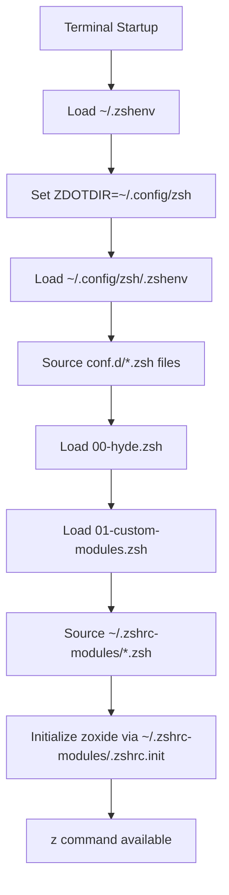

# Zoxide Configuration Troubleshooting: Dual Zsh Configuration Systems

## Problem Summary

The `z` command (zoxide) wasn't working in new terminal sessions, requiring manual sourcing of `~/.zshrc` to function properly. This document details the root cause analysis and solution.

## Root Cause Analysis

### The Discovery Process

1. **Initial Symptoms**
   - `z` command not available in new terminal sessions
   - Had to manually run `source ~/.zshrc` to make it work
   - Zoxide was properly installed (`zoxide 0.9.8` at `/usr/bin/zoxide`)

2. **Configuration Investigation**
   - Found zoxide initialization in `~/.zshrc-modules/.zshrc.init`:
     ```bash
     eval "$(zoxide init zsh)"
     ```
   - Main `~/.zshrc` properly sources modular configuration from `~/.zshrc-modules/`

3. **The Critical Discovery: ZDOTDIR Override**
   - **Key File**: `~/.zshenv` contains:
     ```bash
     XDG_CONFIG_HOME="${XDG_CONFIG_HOME:-$HOME/.config}"
     export ZDOTDIR="${ZDOTDIR:-$XDG_CONFIG_HOME/zsh}"
     ```
   - This redirects zsh to use `~/.config/zsh/` instead of `~/.zshrc`
   - Result: Two separate configuration systems running in parallel

### Dual Configuration Systems Identified

| System | Location | Purpose | Status |
|--------|----------|---------|--------|
| **Custom Modular** | `~/.zshrc` + `~/.zshrc-modules/` | Personal configuration with zoxide | Not loaded |
| **HyDE XDG-Compliant** | `~/.config/zsh/` | Desktop environment integration | Active |

## The Solution

### Implementation Strategy

Created a bridge configuration file that integrates the existing modular setup into the active XDG-compliant system.

**File Created**: `~/.config/zsh/conf.d/01-custom-modules.zsh`

```bash
#!/usr/bin/env zsh

# Load custom zshrc modules from ~/.zshrc-modules/
# This integrates the existing modular zsh configuration

# Check if the modules directory exists
if [[ -d "$HOME/.zshrc-modules" ]]; then
    # Source the modules in the same order as the original .zshrc
    modules_to_load=(
        "starship"
        "ohmyzsh"
        "envvars"
        "aliases"
        "functions"
        "init"          # ← Contains zoxide initialization
        "paths"
        "appearance"
        "sec"
    )
    
    for module in "${modules_to_load[@]}"; do
        module_file="$HOME/.zshrc-modules/.zshrc.$module"
        if [[ -f "$module_file" ]]; then
            source "$module_file"
        fi
    done
    
    # Also source the main secrets file if it exists
    [[ -f "$HOME/.zshrc-sec" ]] && source "$HOME/.zshrc-sec"
fi
```

### Why This Works

1. **Automatic Loading**: Files in `~/.config/zsh/conf.d/` are automatically sourced by the XDG system
2. **Correct Order**: `01-` prefix ensures loading after HyDE base config (`00-hyde.zsh`)
3. **Module Preservation**: Maintains exact loading order from original `~/.zshrc`
4. **Clean Integration**: No modification of existing modular configuration needed

## Technical Deep Dive

### Shell Initialization Flow



### Key Learning Points

1. **ZDOTDIR Environment Variable**
   - Overrides default `~/.zshrc` location
   - Part of XDG Base Directory Specification compliance
   - Common in modern Linux desktop environments

2. **Configuration File Precedence**
   - `~/.zshenv` → `~/.config/zsh/.zshenv` → `conf.d/*.zsh` → `~/.config/zsh/.zshrc`
   - Numbered prefixes control loading order within `conf.d/`

3. **HyDE Desktop Integration**
   - Uses XDG-compliant configuration structure
   - Separates user customizations from system configuration
   - Follows modern Linux desktop standards

## Testing and Verification

### Verification Commands

```bash
# Check if zoxide is available
type z

# Verify configuration loading
zsh -c "source ~/.config/zsh/conf.d/01-custom-modules.zsh && type z"

# Check ZDOTDIR setting
echo "ZDOTDIR: $ZDOTDIR"

# Verify active configuration location
echo "Active zsh config: ${ZDOTDIR:-$HOME}/.zshrc"
```

### Expected Output

```bash
$ type z
z is a shell function from /home/jordan/.zshrc-modules/.zshrc.init
```

## Alternative Solutions Considered

1. **Direct Integration**: Add `eval "$(zoxide init zsh)"` to `~/.config/zsh/.zshrc`
   - **Rejected**: Would duplicate configuration and break modularity

2. **Symlink Approach**: Create symlink from `~/.config/zsh/.zshrc` to `~/.zshrc`
   - **Rejected**: Could conflict with HyDE's configuration management

3. **Environment Variable Override**: Unset `ZDOTDIR` in shell startup
   - **Rejected**: Would break XDG compliance and HyDE integration

## Prevention and Best Practices

### For Future Configuration Issues

1. **Always Check ZDOTDIR**
   ```bash
   echo "Active config location: ${ZDOTDIR:-$HOME}/.zshrc"
   ```

2. **Understand Configuration Hierarchy**
   - Check for `~/.zshenv` files that might redirect configuration
   - Look for XDG-compliant setups in `~/.config/`

3. **Test Configuration Changes**
   ```bash
   # Test in clean shell
   zsh -c "source your_config_file && your_command"
   ```

4. **Use Modular Integration Patterns**
   - Prefer bridge files over direct modifications
   - Maintain separation between system and user configs

## Related Files

- **Configuration Bridge**: `~/.config/zsh/conf.d/01-custom-modules.zsh`
- **Zoxide Module**: `~/.zshrc-modules/.zshrc.init:13`
- **ZDOTDIR Setting**: `~/.zshenv:4`
- **HyDE Base Config**: `~/.config/zsh/conf.d/00-hyde.zsh`

---

**Resolution Date**: 2025-01-13  
**Issue**: Zoxide `z` command not available in new sessions  
**Status**: ✅ Resolved  
**Method**: XDG-compliant configuration bridge