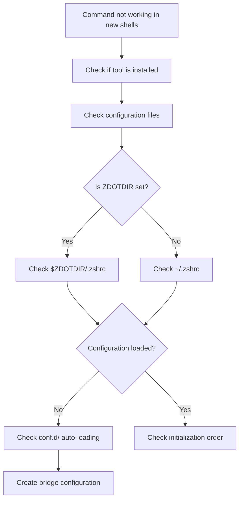

# Understanding Dual Zsh Configuration Systems

## Overview

This document explains the discovery and resolution of a dual zsh configuration system that was causing tools like zoxide to not work in new terminal sessions.

## The Two Systems

### System 1: Custom Modular Configuration (Inactive)
**Location**: `~/.zshrc` + `~/.zshrc-modules/`

```
~/.zshrc                           # Main configuration file
└── ~/.zshrc-modules/             # Modular configuration directory
    ├── .zshrc.starship          # Starship prompt
    ├── .zshrc.ohmyzsh           # Oh My Zsh setup
    ├── .zshrc.envvars           # Environment variables
    ├── .zshrc.aliases           # Command aliases
    ├── .zshrc.functions         # Custom functions
    ├── .zshrc.init              # Tool initialization (including zoxide)
    ├── .zshrc.paths             # PATH modifications
    ├── .zshrc.appearance        # Visual customizations
    └── .zshrc.sec               # Security configurations
```

**Key Feature**: Contains `eval "$(zoxide init zsh)"` in `.zshrc.init`

### System 2: HyDE XDG-Compliant Configuration (Active)
**Location**: `~/.config/zsh/`

```
~/.config/zsh/
├── .zshenv                      # Environment setup
├── .zshrc                       # User customizations
├── conf.d/                      # Auto-loaded configuration
│   ├── 00-hyde.zsh             # HyDE desktop integration
│   └── 01-custom-modules.zsh   # Bridge to modular config (our fix)
└── user.zsh                     # Additional user settings
```

**Key Feature**: XDG Base Directory Specification compliant

## The Root Cause

### ZDOTDIR Override Discovery

The issue was traced to `~/.zshenv`:

```bash
#!/usr/bin/env zsh

XDG_CONFIG_HOME="${XDG_CONFIG_HOME:-$HOME/.config}"
export ZDOTDIR="${ZDOTDIR:-$XDG_CONFIG_HOME/zsh}"

if ! source $ZDOTDIR/.zshenv; then
    echo "FATAL Error: Could not source $ZDOTDIR/.zshenv"
    return 1
fi
```

**Impact**:
- Redirects zsh to use `~/.config/zsh/` instead of `~/.zshrc`
- Custom modular configuration becomes inaccessible
- Tools initialized in modules (like zoxide) don't load

### Why This Happened

1. **HyDE Desktop Environment**: Implements XDG Base Directory Specification
2. **Configuration Isolation**: Separates system configs from user configs
3. **Modern Linux Standards**: Follows contemporary configuration practices
4. **Unaware Migration**: Existing dotfiles weren't integrated into new system

## Detection Methods

### Quick Check Commands

```bash
# Check active configuration location
echo "ZDOTDIR: ${ZDOTDIR:-$HOME}"
echo "Active config: ${ZDOTDIR:-$HOME}/.zshrc"

# Check if custom modules exist but aren't loaded
ls ~/.zshrc-modules/
type z  # Should fail if modules aren't loaded

# Verify XDG compliance
echo "XDG_CONFIG_HOME: $XDG_CONFIG_HOME"
ls ~/.config/zsh/
```

### Diagnostic Workflow



## The Solution Pattern

### Bridge Configuration Approach

Instead of modifying existing systems, create a bridge:

1. **Identify Active System**: Determine which configuration system is actually loading
2. **Create Integration Point**: Add bridge file in active system's auto-load directory
3. **Preserve Modularity**: Source existing modular configuration intact
4. **Maintain Order**: Ensure proper loading sequence

### Implementation Details

**File**: `~/.config/zsh/conf.d/01-custom-modules.zsh`

```bash
#!/usr/bin/env zsh

# Bridge configuration to integrate existing modular setup
if [[ -d "$HOME/.zshrc-modules" ]]; then
    # Define loading order (critical for dependencies)
    modules_to_load=(
        "starship"    # Prompt must load early
        "ohmyzsh"     # Framework setup
        "envvars"     # Environment variables
        "aliases"     # Command shortcuts
        "functions"   # Custom functions
        "init"        # Tool initialization ← zoxide lives here
        "paths"       # PATH modifications
        "appearance"  # Visual customizations
        "sec"         # Security settings
    )
    
    # Load each module if it exists
    for module in "${modules_to_load[@]}"; do
        module_file="$HOME/.zshrc-modules/.zshrc.$module"
        [[ -f "$module_file" ]] && source "$module_file"
    done
    
    # Load additional secret configurations
    [[ -f "$HOME/.zshrc-sec" ]] && source "$HOME/.zshrc-sec"
fi
```

### Why This Pattern Works

1. **Non-Invasive**: Doesn't modify existing configurations
2. **Automatic**: Leverages existing auto-loading mechanisms
3. **Ordered**: Uses numeric prefixes to control load sequence
4. **Maintainable**: Clear separation of concerns
5. **Reversible**: Easy to remove if needed

## Prevention Strategies

### For System Administrators

1. **Document Configuration Changes**
   ```bash
   # Always document ZDOTDIR changes
   echo "# ZDOTDIR redirect added $(date)" >> ~/.zshenv
   export ZDOTDIR="$HOME/.config/zsh"
   ```

2. **Provide Migration Scripts**
   ```bash
   # Example migration helper
   migrate_zsh_config() {
       local old_config="$HOME/.zshrc"
       local new_config="$ZDOTDIR/user.zsh"
       
       if [[ -f "$old_config" && ! -f "$new_config" ]]; then
           echo "Migrating $old_config to $new_config"
           cp "$old_config" "$new_config"
       fi
   }
   ```

3. **Check for Existing Configurations**
   ```bash
   # Detect conflicting setups during installation
   check_existing_configs() {
       [[ -f ~/.zshrc ]] && echo "Warning: Existing ~/.zshrc detected"
       [[ -d ~/.zshrc-modules ]] && echo "Info: Modular config found"
   }
   ```

### For Users

1. **Understand Your Configuration System**
   ```bash
   # Add to your debugging toolkit
   debug_zsh_config() {
       echo "Shell: $0"
       echo "ZDOTDIR: ${ZDOTDIR:-'unset (using ~/.zshrc)'}"
       echo "Config files loaded:"
       echo "  - ${ZDOTDIR:-$HOME}/.zshrc"
       [[ -d "${ZDOTDIR:-$HOME}/conf.d" ]] && \
           ls "${ZDOTDIR:-$HOME}/conf.d/"*.zsh 2>/dev/null
   }
   ```

2. **Test Configuration Changes**
   ```bash
   # Always test in clean shell
   test_config() {
       zsh -c "$1 && echo 'Success: $1'"
   }
   ```

3. **Keep Configuration Portable**
   - Use environment variables for paths
   - Check for file existence before sourcing
   - Provide fallbacks for missing dependencies

## Common Patterns

### XDG Compliance Detection

```bash
# Check if system uses XDG Base Directory Specification
is_xdg_compliant() {
    [[ -n "$XDG_CONFIG_HOME" ]] && \
    [[ -n "$ZDOTDIR" ]] && \
    [[ "$ZDOTDIR" == "$XDG_CONFIG_HOME"* ]]
}
```

### Auto-Loading Mechanisms

```bash
# Common auto-loading patterns
load_config_dir() {
    local config_dir="$1"
    for config_file in "$config_dir"/*.zsh; do
        [[ -r "$config_file" ]] && source "$config_file"
    done
}
```

### Configuration Bridges

```bash
# Template for bridge configurations
create_bridge() {
    local source_config="$1"
    local target_dir="$2"
    
    cat > "$target_dir/99-bridge.zsh" << EOF
#!/usr/bin/env zsh
# Bridge configuration created $(date)
[[ -f "$source_config" ]] && source "$source_config"
EOF
}
```

## Related Documentation

- [Zoxide Troubleshooting Guide](./zoxide-zsh-troubleshooting.md)
- [XDG Base Directory Specification](https://specifications.freedesktop.org/basedir-spec/basedir-spec-latest.html)
- [Zsh Configuration Best Practices](./zsh-best-practices.md)

---

**Last Updated**: 2025-01-13  
**Author**: System Analysis  
**Status**: ✅ Complete